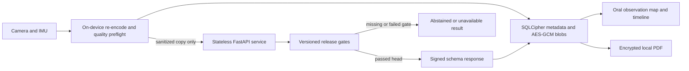

# OralSight architecture

> **This result is not a diagnosis.** OralSight is a non-diagnostic research
> prototype. A passing engineering check is not clinical validation.

## Trust boundaries



The mobile installation is the only intended application persistence boundary. The
service has no accounts, database, queue, object store, analytics pipeline, or retained
job. FastAPI's multipart parser may spool a bounded upload to its temporary-file backing
store before application code runs. The service closes every upload in `finally`, retains
no application-managed copy, and returns `Cache-Control: no-store`. A production
deployment must place the process temporary directory on encrypted ephemeral storage or
`tmpfs`, enforce ingress/request limits, and verify cleanup under success and failure.

## Monorepo responsibilities

| Path                 | Responsibility                                                                                                                                                    |
| -------------------- | ----------------------------------------------------------------------------------------------------------------------------------------------------------------- |
| `apps/mobile`        | Expo development-build app, camera workflow, local encryption, 3D observation map, comparison, timeline, and a local observation PDF for clinician discussion     |
| `packages/contracts` | Canonical eight-region enum, request/result schemas, provenance values, and cross-field safety invariants                                                         |
| `services/inference` | Four-route stateless API, sanitization, release-gate enforcement, disabled-by-default developer fixtures, registration diagnostics, and detached response signing |
| `ml`                 | Patient-disjoint manifest validation, evaluation/calibration utilities, fail-closed release gates, DVC templates, and research-only baselines                     |
| `assets/mouth`       | Versioned procedural map manifest and named region meshes                                                                                                         |
| `docs`               | Intended use, forbidden claims, threat model, rule-file contract, licenses, model cards, competition evidence, and disclosures                                    |

## Capture acceptance

A region counts toward the eight-region photography session after local and
server quality acceptance plus explicit user confirmation of privacy and the
selected region. An unavailable learned head does not discard a usable,
protected photograph. Its result remains an explicit abstention and can be
retried later.

A server quality rejection or supported anatomy mismatch does not complete the
region. Rejected temporary plaintext and encrypted blobs are removed. If a
previously saved offline capture is rejected during retry, the capture and any
report containing it are removed.

The hash-pinned anatomy head is enabled and rejects a supported mismatch before a
capture completes the selected region. The mobile app runs an on-device ML Kit
face-presence check and still requires manual mouth-only/privacy confirmation
before upload. The server repeats its own face and quality checks after transient
upload. Developer fixtures require explicit disabled-by-default service
configuration, exist only for isolated backend and contract tests, and are not
imported by the mobile app. The installed client accepts live inputs only and
rejects fixture-derived response origins.

## Analysis and comparison gates

The runtime response from `GET /v1/model-card` is authoritative for the deployed service.
The Markdown model-card files document the working tree and templates; they do not
override runtime state. A head is enabled only when its locked evaluation metrics and
required review fields pass the matching gate. With the working tree's default
artifacts, anatomy validation is enabled; segmentation, appearance,
disease-category research, and lesion re-identification are disabled.

The generated JSON Schema bundle describes public structure and the analyze-origin
discriminated union. Cross-field safety invariants for analysis, comparison, and model
cards are authoritative in the canonical Zod validators and mirrored Pydantic models;
consumers must run those validators rather than treating structural JSON Schema success
as a complete policy decision.

Comparison metadata binds capture and region identifiers to their prior analysis
references, but those caller-supplied fields never drive a live measurement. The
service recomputes image quality and, once released, both candidate areas from
the sanitized comparison images. A change value requires:

- mandatory user confirmation;
- registration inlier ratio of at least `0.60`;
- reprojection error of at most `0.03` of the image diagonal;
- repeated-capture area error of at most `0.10`; and
- the corresponding locked validation/release artifact.

If any requirement is absent, `comparable` is false and `normalizedChange` is
null. The current mobile comparison preview is an unwarped opacity blend of the two
source images. It must not be described as an aligned or registered visual overlay;
registration diagnostics gate the numeric research output only.

## Response authenticity

Non-loopback mobile deployments require HTTPS and a pinned Ed25519 public key.
The server signs the exact UTF-8 JSON body using the domain-separated message:

```text
oralsight-response-v1\n<request-id>\n<raw-response-body>
```

The client verifies the signature, request ID, derived key ID, schema, capture
identifiers, region, provenance, and cross-field invariants before storing a
result. Unsigned HTTP is accepted only for an explicit loopback development URL.

## Deletion

Delete-all closes storage, removes the SQLCipher database, encrypted images,
encrypted reports, and temporary previews, then rotates both installation keys.
Superseded single-region captures are removed rather than retained as hidden
duplicates. Longitudinal comparison uses captures from distinct sessions. Complete
deletion and key rotation passed on an Android emulator; physical-device backup,
low-storage, interrupted-operation, and recovery testing remains release-blocking.
