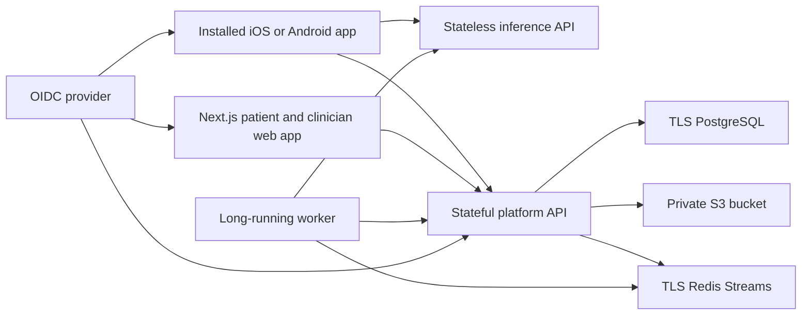

# OralSight deployment handoff

Last reviewed: 2026-08-26

This guide separates what is present in source from what still needs an
account, credential, managed service, physical device, or real deployment. A
successful software deployment does not establish clinical accuracy or
regulatory status.

> **This result is not a diagnosis.**

## Deployment state

| Surface               | Current evidence                                                                                                                                                                                                                                          | Deployment status                                                        |
| --------------------- | --------------------------------------------------------------------------------------------------------------------------------------------------------------------------------------------------------------------------------------------------------- | ------------------------------------------------------------------------ |
| Inference API         | `https://oralsight-inference.vercel.app/api/healthz` and `/api/v1/model-card` returned `200`, `Cache-Control: no-store`, production signing, release ID `oralsight-segmentation-release-2026-07-28`, and enabled anatomy/segmentation heads on 2026-08-08 | An older inference-only release is live                                  |
| Current web app       | Next.js source, tests, build script, Auth0 integration, and Vercel configuration are in the repository                                                                                                                                                    | No deployment of the current tree has been verified                      |
| Stateful platform API | Container, migrations, OIDC validation, PostgreSQL, private object storage, consent, sync, sharing, reports, audit, retention, and deletion paths are in the repository                                                                                   | No production deployment has been verified                               |
| Durable worker        | Container, Redis consumer, artifact rendering, report/video/export/deletion processors, retry, heartbeat, and cleanup paths are in the repository                                                                                                         | No production deployment has been verified                               |
| Mobile app            | Expo development-build source and EAS profiles are present                                                                                                                                                                                                | No final `.aab` or `.ipa` from the current tree exists in this workspace |
| Full product          | The mobile, web, platform, worker, and inference pieces exist as separate deployable surfaces                                                                                                                                                             | Not yet proven end to end in one production environment                  |

Do not describe the current source tree as deployed merely because the older
inference endpoint is live.

## Runtime map



The web app and stateless inference API may run on Vercel. The platform API,
Redis consumer, PostgreSQL, and S3 storage are a separate container deployment.
The worker must run as a continuously available process; it is not a request-time
Vercel Function. The mobile app is installed through EAS, TestFlight, the App
Store, or Google Play; a domain does not replace the native build.

## External resources required

Before a complete public deployment, the owner must provide:

1. The public `rohit47108/oralsight` repository. The complete source now lives
   in its local checkout at `C:\Users\rohit\Projects\oralsight`. The private
   Autooral-assisted segmentation weight is excluded from the public source;
   deployment supplies it through the ignored, hash-verified release bundle.
2. The current public web and signed inference releases are verified on the
   `oralsight` and `oralsight-inference` Vercel projects. A future hosted account
   platform still needs its own production environment values and stateful host.
3. An OIDC provider such as Auth0 with a public native client, a regular web
   client, an API audience, asymmetric signing, and the required patient,
   `clinician_pending`, clinician, and administrator role claims. The platform
   defaults to the access-token claim `https://oralsight.app/roles`. It never
   falls back to a generic `roles` claim; production must deliberately emit or
   configure the exact claim.
4. Managed PostgreSQL with TLS and point-in-time recovery.
5. Managed Redis with TLS, authentication, persistence, and `noeviction`.
6. A private S3 bucket with all Block Public Access controls enabled, Bucket
   owner enforced Object Ownership, TLS-only access, encryption, and lifecycle
   rules matching the published retention periods.
7. A container registry and a host capable of running the platform API,
   inference service, and at least one continuously running worker.
8. DNS and TLS for the web, platform API, and inference origins.
9. A secret manager for OIDC, response-signing, worker HMAC, share derivation,
   database, Redis, and KMS material.
10. Expo, Apple Developer, and Google Play accounts plus signing credentials for
    installable release builds.
11. Physical iPhones and Android phones for the release device matrix.
12. The repository source is MIT licensed. The private segmentation bundle uses
    Autooral under academic-research/non-commercial terms and is suitable only
    for the competition deployment described by its inventory record. A later
    commercial release needs a replacement weight or broader permission.
13. A published privacy/retention notice that matches operations. The checked
    privacy page states the runbook's maximum 35-day encrypted backup lifetime;
    the deployed storage and backup policies must match it.
14. Final native application identifiers. The checked source still uses
    `org.oralsight.prototype` and has no owner-specific Expo project ID.
15. A hash-bound, reviewer-approved repeated-capture evaluation with area error
    no greater than 10% before any normalized or calibrated longitudinal change
    is enabled. A display registration transform does not satisfy this gate.

The application remains usable in local-only mode when account services are not
configured. Accounts, cloud sync, QR sharing, clinician review, server-rendered
artifacts, and cloud deletion require the platform stack and OIDC.

## Prepare a release commit

Use Node 22 to 24, pnpm 11.9.0, Python 3.12 or 3.13, `uv`, Docker, and Git.
Load the real release web environment from a protected location before the web
build; do not enable the CI dummy-value switch for a release. From the repository
root:

```powershell
corepack enable
pnpm install --frozen-lockfile
pnpm contracts:generate
git diff --exit-code -- packages/contracts/generated
pnpm test
pnpm typecheck
pnpm --filter @oralsight/web lint
pnpm --filter @oralsight/web build
pnpm audit:dependencies
pnpm format:check

uv sync --frozen --all-packages --extra dev
uv run --frozen --all-packages --no-sync pytest `
  services/inference/tests services/platform-api/tests services/worker/tests ml/tests
uvx --from ruff==0.14.14 ruff check `
  services/inference services/platform-api services/worker ml .github/scripts
uvx --from ruff==0.14.14 ruff format --check `
  services/inference services/platform-api services/worker ml .github/scripts
uvx --from jsonschema==4.26.0 python `
  .github/scripts/validate_vercel_config.py

python .github/scripts/audit_repository.py
docker compose -f compose.yaml config --quiet
docker compose --env-file deploy/production/production.env.example `
  -f compose.production.yaml config --quiet
```

Before publishing a repository, scan the complete Git object history as well as
the working tree for secrets, restricted images, patient data, databases, and
unlicensed artifacts. The `secret-scan` workflow uses digest-pinned Gitleaks
against all Git history. The repository audit validates the checked tree; neither
check replaces a deliberate license and patient-data review.

Then run Expo Doctor, public-config inspection, Android export, and iOS export as
listed in [`MOBILE_BUILD_AND_DEPLOY.md`](MOBILE_BUILD_AND_DEPLOY.md). Do not
continue to production if generated contracts drift, the repository audit fails,
or any current-tree check is red.

The GitHub workflows reproduce these checks after the repository is pushed. The
Python workflow also copies each service's `pyproject.toml`, `README.md`, and
`uv.lock` outside the monorepo before `uv lock --check`, which proves the three
container/Vercel locks stand on their own instead of silently using the root
workspace lock. A workflow file in source is not evidence that a hosted run
passed.

## Run the complete stack locally

Start the data and Python services:

```powershell
docker compose up -d --build
docker compose ps
```

This publishes PostgreSQL on `127.0.0.1:5432`, Redis on
`127.0.0.1:6379`, inference on `127.0.0.1:8000`, the platform API on
`127.0.0.1:8001`, and worker health on `127.0.0.1:8010`.
The Compose stack signs inference responses with a documented, public
development-only key and pins its public half in the worker. Override all three
`ORALSIGHT_LOCAL_RESPONSE_SIGNING_*` values together to exercise key rotation;
never reuse the checked-in development key in staging or production.

Run the web app separately from the repository root:

```powershell
Copy-Item apps/web/.env.example apps/web/.env.local
pnpm --filter @oralsight/web dev
```

For the web app, `ORALSIGHT_PLATFORM_API_URL` must match the Compose port:
`http://127.0.0.1:8001`. Interactive web and mobile sign-in still needs a real
development OIDC application. The platform's `local_test` token mode is for
automated tests and direct development calls; it is not an OIDC discovery,
authorization, or token server.

For a device build, set the inference, platform, OIDC, web, and share-viewer
values described below. Plain HTTP is accepted only for loopback development.

Stop the local stack without deleting its volumes:

```powershell
docker compose down
```

Deleting volumes removes local development data and is intentionally not part
of the normal shutdown command.

## Configure the web app

Set these values in every Vercel environment that will be exercised:

| Variable                     | Purpose                                              |
| ---------------------------- | ---------------------------------------------------- |
| `AUTH0_DOMAIN`               | OIDC tenant domain                                   |
| `AUTH0_CLIENT_ID`            | Auth0 regular web application ID                     |
| `AUTH0_CLIENT_SECRET`        | Server-only web client secret                        |
| `AUTH0_SECRET`               | Random secret used to protect web sessions           |
| `APP_BASE_URL`               | Exact public origin for this deployment              |
| `NEXT_PUBLIC_SITE_URL`       | Public origin used for metadata, sitemap, and robots |
| `AUTH0_AUDIENCE`             | Exact platform API audience                          |
| `ORALSIGHT_PLATFORM_API_URL` | Server-only HTTPS origin of the platform API         |

For a public competition deployment before hosted accounts are connected, set
`ORALSIGHT_WEB_MODE=public` and `NEXT_PUBLIC_SITE_URL` to the deployed HTTPS
origin. The public site, product explanation, privacy, security, evidence, and
professional pages remain available. Account-only routes send visitors to the
mobile product flow instead of exposing a broken identity-provider link. Remove
`ORALSIGHT_WEB_MODE=public` after the Auth0 and platform values above are set and
verified.

Register exact callback, logout, and web-origin URLs for production and each
preview environment with the OIDC provider. Never put a client secret, access
token, database URL, or signing private key in a `NEXT_PUBLIC_*` variable.

The production build stops before compilation if any required web value is
missing or still looks like a placeholder. CI may use explicit dummy values only
with both `CI=true` and `ORALSIGHT_ALLOW_CI_DUMMY_WEB_ENV=true`. The bypass is
disabled whenever `VERCEL=1`, so it cannot make a real Vercel deployment pass.

## Configure the inference API

The production inference runtime requires:

```text
ORALSIGHT_DEPLOYMENT_MODE=production
ORALSIGHT_REQUIRE_RESPONSE_SIGNING=true
ORALSIGHT_RESPONSE_SIGNING_PRIVATE_KEY_B64=<raw 32-byte Ed25519 private key in base64>
ORALSIGHT_RESPONSE_SIGNING_KEY_ID=<derived key ID>
ORALSIGHT_RESPONSE_SIGNING_PUBLIC_KEY_B64=<raw 32-byte Ed25519 public key in base64 for worker Compose wiring>
ORALSIGHT_ENABLE_DEMO_FIXTURES=false
ORALSIGHT_MAX_CONCURRENT_INFERENCE=2
ORALSIGHT_RATE_LIMIT_PER_CLIENT=30
ORALSIGHT_RATE_LIMIT_GLOBAL=300
ORALSIGHT_RATE_LIMIT_WINDOW_SECONDS=60
```

The three rate-limit values are process-local safety limits. Keep an additional
rate limit at the public ingress, especially when more than one inference replica
is running.

Generate one matching key set with
`uv run --project services/inference python services/inference/scripts/generate_signing_key.py`.
Store the private value only in the inference secret manager. The worker receives
the public value as
`ORALSIGHT_WORKER_INFERENCE_RESPONSE_SIGNING_PUBLIC_KEY_B64`; mobile receives the
same public bytes through `EXPO_PUBLIC_RESPONSE_SIGNING_PUBLIC_KEY_B64`. The
worker derives the expected 16-character key ID from the public bytes.

The packaged Vercel entry point sets the hash-pinned release manifest path when
the release directory is present. The matching raw public key is compiled into
the mobile release. Rotate the private key and mobile public-key pin together;
old app builds cannot trust a newly rotated key unless a deliberate overlap
strategy is added.

## Deploy web and inference on Vercel

### Current competition deployment

The root [`vercel.json`](../vercel.json) deploys the Next.js product and proxies
`/api/v1/*` plus `/api/healthz` to the independently deployed, signed inference
service at `https://oralsight-inference.vercel.app/api`. Keeping these releases
separate lets the public website deploy without copying the private model bundle
into its build. The standalone inference deployment remains defined by
[`services/inference/vercel.json`](../services/inference/vercel.json) and the
`[tool.vercel]` entry point in its `pyproject.toml`.

The linked web project is `oralsight`. The inference project is
`oralsight-inference`. Never replace the inference proxy with an unverified model
build; its health and model-card responses must report signing, the expected
release ID, and the enabled heads before a web deployment is promoted.

Use Vercel CLI 48.1.8 or newer. The globally installed CLI in this workspace is
older, so use a pinned current CLI for release work:

```powershell
pnpm dlx vercel@58.8.0 link
pnpm dlx vercel@58.8.0 env pull .vercel/.env.preview.local --environment=preview
pnpm dlx vercel@58.8.0 build
pnpm dlx vercel@58.8.0 deploy --prebuilt
```

Inspect and test the preview before promotion:

```powershell
pnpm dlx vercel@58.8.0 inspect <preview-url>
pnpm dlx vercel@58.8.0 logs <preview-url>
pnpm dlx vercel@58.8.0 promote <preview-url>
```

Do not reuse an existing project link without checking its project name. In the
current development workspace, the root `.vercel` link points to `oralsight`.
Link and deploy `services/inference` separately only when intentionally replacing
the live model release, because that deployment also requires the ignored private
release bundle and the response-signing secret.

Vercel's current FastAPI runtime turns the service into one Function and applies
Function limits, including request size, duration, memory, and bundle size. Run
an actual preview build and live analyze/compare smoke before production; source
inspection is not a substitute for a successful Vercel build.

The standalone inference configuration sets the Function duration to 60 seconds.
Confirm that the selected plan supports that value, then exercise analyze and
compare against a real preview.
The mobile request timeout remains a separate client limit and does not prove
that a 60-second Function is appropriate under load.

## Deploy the stateful platform and worker

Use [`compose.production.yaml`](../compose.production.yaml) with the operator
steps in [`deploy/production/RUNBOOK.md`](../deploy/production/RUNBOOK.md). It
starts application containers only. PostgreSQL, Redis, S3, OIDC, DNS, TLS, and
the reverse proxy remain operator-owned.

Build, scan, push, and record immutable image digests:

```powershell
docker build -t <registry>/oralsight-platform-api:<version> services/platform-api
docker build -t <registry>/oralsight-inference:<version> services/inference
docker build -t <registry>/oralsight-worker:<version> services/worker
```

Populate a copy of `deploy/production/production.env.example` in a protected
location outside Git. Use digest-pinned image references. Then:

```powershell
docker network create oralsight-ingress
docker compose --env-file C:\secure\oralsight-production.env `
  -f compose.production.yaml config --quiet
docker compose --env-file C:\secure\oralsight-production.env `
  -f compose.production.yaml up -d
docker compose --env-file C:\secure\oralsight-production.env `
  -f compose.production.yaml ps
```

The ingress proxy must route the public platform origin to `platform-api:8080`
and the public inference origin to `inference:8000`. Do not expose the worker,
PostgreSQL, Redis, or S3 admin surface publicly. Run multiple workers only with
unique `ORALSIGHT_WORKER_CONSUMER_NAME` values.

Production startup fails closed when it sees local authentication, SQLite,
plain Redis, local object storage, HTTP public URLs, default secrets, or
automatic schema creation. Keep that behavior enabled.

Set `ORALSIGHT_PLATFORM_OIDC_ROLE_CLAIM` when the identity provider uses a
different access-token role claim. A web profile field is not enough: the role
must be present in the API access token, and verified-clinician status is still
checked in PostgreSQL before professional access is granted. Set
`ORALSIGHT_PLATFORM_PRIVILEGED_TOKEN_MAX_AGE_SECONDS` between 60 and 3600
seconds, and configure the provider to refresh access tokens within that limit.

### Bootstrap the first administrator

There is no HTTP endpoint that can create an administrator. First have the
owner-designated administrator sign in once, which provisions a patient account.
Then run the one-time command inside the platform container. Read the exact OIDC
subject interactively so it does not enter shell history, store it only in the
current process, and pass only the variable name to Compose:

```powershell
$bootstrapSubject = Read-Host "Exact OIDC subject for the first administrator"
$env:ORALSIGHT_PLATFORM_BOOTSTRAP_ADMIN_SUBJECT = $bootstrapSubject
$env:ORALSIGHT_PLATFORM_BOOTSTRAP_CONFIRMATION = "BOOTSTRAP ORALSIGHT FIRST ADMIN"
docker compose --env-file C:\secure\oralsight-production.env `
  -f compose.production.yaml exec `
  -e ORALSIGHT_PLATFORM_BOOTSTRAP_ADMIN_SUBJECT `
  -e ORALSIGHT_PLATFORM_BOOTSTRAP_CONFIRMATION `
  platform-api oralsight-bootstrap-admin
Remove-Item Env:ORALSIGHT_PLATFORM_BOOTSTRAP_ADMIN_SUBJECT
Remove-Item Env:ORALSIGHT_PLATFORM_BOOTSTRAP_CONFIRMATION
$bootstrapSubject = $null
```

The command requires an existing active account, serializes concurrent
production attempts, and does not print or write the subject into audit details.
The first successful promotion creates a durable, identity-free database seal.
It is idempotent only for the same sole administrator, refuses every different
target, and cannot reopen merely because administrator or audit rows were later
removed. Assign `admin` in the configured access-token role claim, then require
the administrator to sign out and back in. The portal stays locked until both
the database role and a freshly validated token role agree.

Add a second administrator before launch. `oralsight-add-admin` is a trusted
infrastructure-operator command, not proof that another administrator personally
approved the change. It requires a distinct active saved administrator as a
reference, exact target and reference subjects supplied through temporary
environment variables, and the confirmation phrase `ADD ORALSIGHT ADMIN`. The
reference proves that this is a normal addition rather than zero-administrator
recovery. The operation is audited without naming an approving person and never
prints either subject.

Run the additional-admin command from a protected operator shell:

```powershell
$targetSubject = Read-Host "Exact OIDC subject for the additional administrator"
$referenceSubject = Read-Host "Exact OIDC subject for an active administrator reference"
$env:ORALSIGHT_PLATFORM_ADMIN_TARGET_SUBJECT = $targetSubject
$env:ORALSIGHT_PLATFORM_ADMIN_REFERENCE_SUBJECT = $referenceSubject
$env:ORALSIGHT_PLATFORM_ADMIN_CONFIRMATION = "ADD ORALSIGHT ADMIN"
docker compose --env-file C:\secure\oralsight-production.env `
  -f compose.production.yaml exec `
  -e ORALSIGHT_PLATFORM_ADMIN_TARGET_SUBJECT `
  -e ORALSIGHT_PLATFORM_ADMIN_REFERENCE_SUBJECT `
  -e ORALSIGHT_PLATFORM_ADMIN_CONFIRMATION `
  platform-api oralsight-add-admin
Remove-Item Env:ORALSIGHT_PLATFORM_ADMIN_TARGET_SUBJECT
Remove-Item Env:ORALSIGHT_PLATFORM_ADMIN_REFERENCE_SUBJECT
Remove-Item Env:ORALSIGHT_PLATFORM_ADMIN_CONFIRMATION
$targetSubject = $null
$referenceSubject = $null
```

Then assign `admin` in the exact configured access-token role claim and require
the additional administrator to sign out and back in. The database promotion
alone does not open administrator routes.

If a durably sealed installation has no saved administrator, use the separate
break-glass command. It refuses an unsealed installation and refuses recovery
while any administrator remains:

```powershell
$recoverySubject = Read-Host "Exact OIDC subject for the recovery administrator"
$env:ORALSIGHT_PLATFORM_RECOVERY_ADMIN_SUBJECT = $recoverySubject
$env:ORALSIGHT_PLATFORM_RECOVERY_CONFIRMATION = "RECOVER ORALSIGHT SEALED INSTALLATION WITH ZERO ADMINS"
docker compose --env-file C:\secure\oralsight-production.env `
  -f compose.production.yaml exec `
  -e ORALSIGHT_PLATFORM_RECOVERY_ADMIN_SUBJECT `
  -e ORALSIGHT_PLATFORM_RECOVERY_CONFIRMATION `
  platform-api oralsight-recover-admin
Remove-Item Env:ORALSIGHT_PLATFORM_RECOVERY_ADMIN_SUBJECT
Remove-Item Env:ORALSIGHT_PLATFORM_RECOVERY_CONFIRMATION
$recoverySubject = $null
```

Assign `admin` in the exact configured token claim and require a fresh sign-in
after recovery. Test this path in staging and retain the operator evidence
outside application logs.

### Complete a clinician approval

Approving professional credentials does not immediately open patient records.
The full applicant path is:

1. The identity administrator creates a searchable invitation reference and
   assigns `clinician_pending` in the configured token claim.
2. The applicant signs out and back in, opens `/professional-apply`, and submits
   that reference with professional credentials.
3. The platform administrator reviews the credentials and invitation reference.
4. After approval, the identity administrator replaces `clinician_pending`
   with `clinician`.
5. The clinician signs out and back in and selects **Check secure access**.
6. Confirm that the portal records the first-observed timestamp and opens only
   patient-authorized records.

That timestamp records when the required role first appeared in a validated,
signed access token. It proves only a past observation. Every protected route
continues to check the current signed token. Privileged token roles are ignored
900 seconds after `iat` by default, plus the configured clock leeway. Removing a
provider role therefore locks a refreshed sign-in immediately and any previously
issued token no later than that bound; it is not instant revocation.

`ORALSIGHT_PLATFORM_PENDING_UPLOAD_LIFETIME_SECONDS` defaults to `3600`. This is
the maximum lifetime of an unfinished upload reservation; retention cleanup must
be running so abandoned reservations and related objects do not remain
indefinitely.

## Configure the mobile release

The full account-enabled mobile build needs all of these public build values:

| Variable                                      | Required value                                                                        |
| --------------------------------------------- | ------------------------------------------------------------------------------------- |
| `EXPO_PUBLIC_INFERENCE_URL`                   | Production HTTPS inference base, including `/api` when using the current Vercel route |
| `EXPO_PUBLIC_RESPONSE_SIGNING_PUBLIC_KEY_B64` | Public half matching the inference signing key                                        |
| `EXPO_PUBLIC_PLATFORM_URL`                    | Production HTTPS platform API origin                                                  |
| `EXPO_PUBLIC_OIDC_ISSUER`                     | OIDC issuer used by the public native client                                          |
| `EXPO_PUBLIC_OIDC_CLIENT_ID`                  | Public native client ID; never a client secret                                        |
| `EXPO_PUBLIC_OIDC_AUDIENCE`                   | Exact platform API audience                                                           |
| `EXPO_PUBLIC_SHARE_VIEWER_URL`                | Web share entry point, normally `https://app.example.org/shared`                      |
| `EXPO_PUBLIC_WEB_URL`                         | Web origin used to open the calibration-card page                                     |

The preview and production EAS profiles select their matching EAS environment.
Add the account-related values to both environments before building; otherwise
the app deliberately remains local-only even though the cloud code is present.

The calibration card has one 20 mm ArUco marker and four fixed neutral patches.
No extra environment variable enables them. A calibrated request carries the
fixed card version, marker ID 17, marker side 20 mm, and the user's same-plane
confirmation. Size estimation and neutral-patch color normalization fail closed
independently. Color normalization may adjust only approximate mean redness and
brightness after every patch gate passes; it never rewrites the image or changes
the mask, anatomy, quality, texture, learned heads, or guidance.

Register the native callback generated for the `oralsight` app scheme with the
OIDC provider, then create the EAS project and build:

Before `eas:configure`, replace `org.oralsight.prototype` with the stable iOS
bundle identifier and Android application ID registered to the owner. Treat
those identifiers as permanent after a store release. Record the EAS project ID
created for the owner's Expo organization.

```powershell
Set-Location apps/mobile
pnpm dlx eas-cli@latest login
pnpm run eas:configure
pnpm run eas:build:android:preview
pnpm run eas:build:ios:preview
```

After the physical-device release matrix passes, create store artifacts with
the production profiles. An Expo export is a JavaScript verification artifact;
it is not an installable `.aab` or `.ipa`.

## Domain layout

A clear production layout is:

```text
app.example.org          Next.js public, patient, shared, and clinician web app
api.example.org          Stateful platform API
inference.example.org    Stateless inference API, if not mounted under app /api
identity.example.org     OIDC provider or custom identity domain
```

The QR share URL must use the stable web origin. Keep the share secret in the URL
fragment until the web app exchanges it for a short-lived HTTP-only cookie.

## Post-deployment acceptance

Record the commit SHA, image digests, Vercel deployment IDs, EAS build IDs, model
release ID, signing key ID, migration revision, and environment names. Then
verify:

1. Web public pages load and authenticated patient, `clinician_pending`,
   clinician, and administrator roles reach only their allowed screens. Prove
   first-admin bootstrap, clinician two-step activation, and fail-closed access
   after removing each privileged token role.
2. `GET /api/healthz` and `GET /api/v1/model-card` report the expected release,
   enabled heads, signing state, and `Cache-Control: no-store`.
3. `GET /readyz` on the platform origin reports database, queue, and object
   storage ready.
4. One synthetic or expressly licensed scan completes all eight regions using
   live model responses. A failed live request produces no fixture result.
5. Account consent, sync, multi-angle upload, report, image-colored generic
   observation surface, summary video, encrypted export, QR
   share/exchange/revoke, clinician review, and access history work through the
   deployed services. Do not describe the GLB as reconstructed patient anatomy.
6. Delete-all removes live database rows and object bytes, revokes shares and
   grants, cancels work, creates the identity tombstone, and causes the mobile
   installation keys to rotate.
7. Logs contain no image bytes, request bodies, query strings, tokens, subjects,
   filenames, or share secrets.
8. Backup restore, lifecycle expiry, dead-letter alerting, key rotation, and
   rollback procedures are exercised in a non-production environment.
9. Two physical iPhones and two physical Android devices complete the required
   scan, quality, accessibility, interruption, storage, sharing, and deletion
   matrix.
10. The public privacy notice states the deployed retention periods, including
    the actual maximum backup lifetime, and matches the configured lifecycle
    rules and operator runbook.
11. The MIT source license and public asset terms are present, and the private
    competition model bundle is absent from public source and download artifacts.
12. Worker analyze and compare jobs reject a missing/altered Ed25519 signature,
    wrong key or request ID, encoded body, missing `no-store`, and malformed JSON
    before accepting an inference result.
13. The app may display a gated registration transform for visual alignment, but
    normalized and calibrated longitudinal change remains unavailable until the
    deployed release includes hash-bound, reviewer-approved repeated-capture
    evidence at no more than 10% area error.
14. A printed-card smoke covers both independent paths: valid marker-plane sizing
    still works when neutral-patch normalization is suppressed, and a passing
    four-patch fit changes only mean redness/brightness while recording
    `neutral-grayscale-patches-affine-rgb-v1`. Repeat this on the required device
    and printer matrix before relying on either estimate.

Only after those checks pass should the current tree be called deployed.

## Rollback and recovery

- Vercel: retain the tested preview deployment and use `vercel promote` or
  `vercel rollback` to move the production alias without rebuilding.
- Containers: retain the previous digest-pinned images. Roll back application
  images only when the database migration is backward compatible; do not run a
  destructive database downgrade as an automatic rollback.
- Data: restore into an isolated network first and follow the no-resurrection
  rules in the production runbook. A completed deletion must not be undone from
  an older database snapshot or S3 version.
- Secrets: treat response-signing, worker HMAC, share derivation, OIDC, database,
  Redis, and KMS rotation as separate procedures with overlap only where the
  clients support it.

## Source ZIP handoff

After the final checks and documentation are frozen, choose the release archive
path from the protected operator shell:

```powershell
$releaseArchive = Read-Host "Absolute path for the final OralSight source archive"
.\scripts\package-source.ps1 `
  -OutputPath $releaseArchive `
  -Force
```

The packager enumerates tracked and non-ignored source through Git, rejects paths
outside the repository, omits ignored secrets/dependencies/data/caches, and
returns a SHA-256. Reopen the archive, confirm the required roots and locked model
files are present, and rerun the repository audit from an extracted copy before
publishing the checksum. The ZIP contains source, not Git history; publishing the
repository itself requires the separate full-history check above.

Useful references:

- [Vercel Services](https://vercel.com/docs/services)
- [Vercel release phases](https://vercel.com/docs/release-phases)
- [FastAPI on Vercel](https://vercel.com/docs/frameworks/backend/fastapi)
- [Vercel environment variables](https://vercel.com/docs/environment-variables)
- [Vercel monorepos](https://vercel.com/docs/monorepos)
- [Expo EAS build setup](https://docs.expo.dev/build/setup/)
